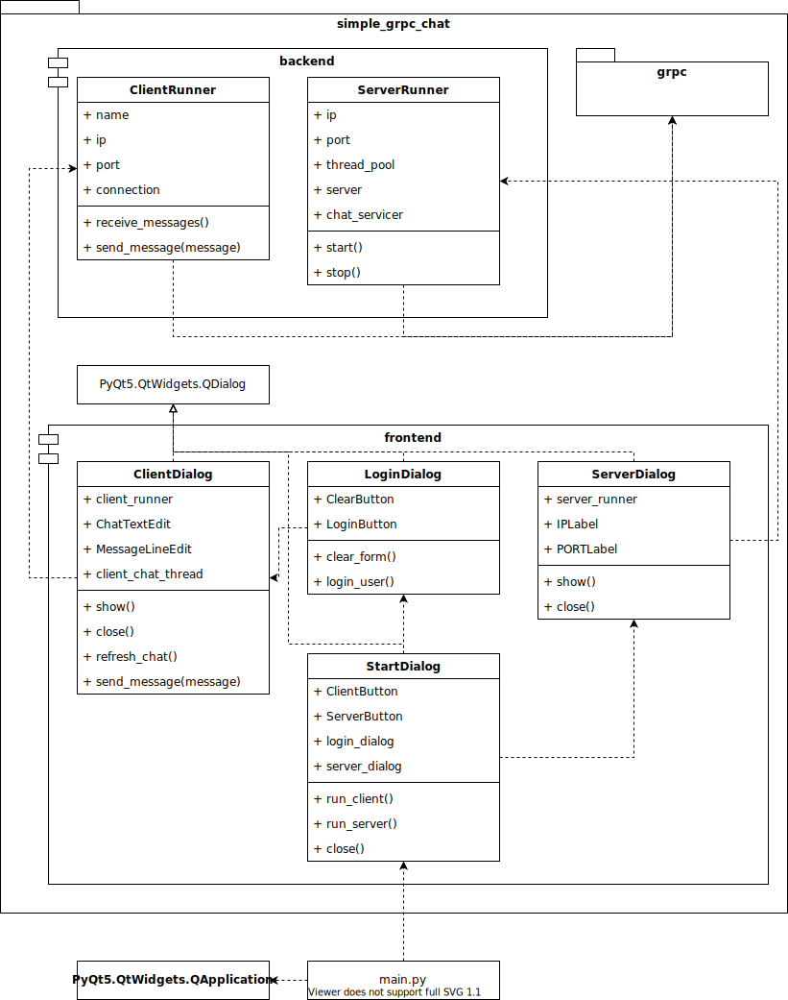

# simple-grpc-chat

[](https://github.com/vdshk/simple-grpc-chat/actions/workflows/lint.yml)

### Description

Implementation of a chat with gRPC in Python.
User could act as a client or server.
If the application runs as a server, the IP address and port will be generated.
Otherwise, the IP and port of a host should be specified and server should be already running.

### Requirements

```shell
pip install -r requirements.txt
```

### Run

```shell
python3 main.py
```

### Architecture


